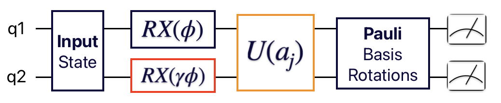

# Use Case: Study Pulse Spillover in Quantum Computers on Gate Level Abstraction

This ReadMe file is supposed to provide a brief overview of the type of noise called *Pulse Spillover* and outline how we model its effect using the gate-level abstraction. We begin by motivating our efforts to model this type of noise and walk you through how it can be investigated with the tools we provide in this repo.

## Motivation

Pulse spillover is a form of noise that occurs in quantum computing systems and arises when control pulses meant to manipulate specific qubits inadvertently affect neighboring qubits. This noise can degrade the performance and reliability of quantum computations and lowering the quality of quantum gate operations. Therefore, it is an important aspect worth studying and addressing in noise-suppression strategies.

## Sources of Pulse Spillover

Pulse spillover can be attributed to several factors:
1. **Cross-talk:** In quantum processors, control signals (microwave pulses, laser pulses, etc.) intended for one qubit can couple to adjacent qubits due to physical proximity and imperfect isolation.
2. **Frequency Crowding:** Quantum bits (qubits) are often controlled using resonant frequencies. If the frequency spectrum of the pulses is not well-contained, it can spill over and interfere with nearby qubits.
3. **Imperfect Pulse Shaping:** Inaccuracies in the generation and shaping of pulses can cause their energy to extend beyond the intended time or frequency range, affecting other qubits.

## Effects of Pulse Spillover Noise

Pulse spillover can have several detrimental effects on quantum computations:
1. **Qubit Decoherence:** Unintended interactions with neighboring qubits can cause qubits to lose their quantum coherence, leading to errors in quantum state evolution.
2. **Reduced Fidelity:** The accuracy of quantum operations can be significantly reduced, impacting the overall fidelity of quantum algorithms and protocols.
3. **Error Propagation:** Errors induced by pulse spillover can propagate through the quantum circuit, compounding the overall error rate and reducing the reliability of computations.

## Modelling Pulse Spillover on the Gate-Level Abstraction

Circuit representation of the pulse-spillover noise. The noise-inducing operation is the $RX(\phi)$ gate, the resulting noise in red with noise strength $\gamma$.
The orange gate depicts the parametrized target gate operation with action vector $\vec{a}_{j}$.

We argue the noise to be linear in $\phi$ and $\gamma$ since the pulse for different rotation angles $\phi$ would lead to a different amplitude in the pulse played on qubit 1. The noise-strength (or alternatively spillover-rate) is hardware-specific to the tuple (qubit 1, qubit 2). \
Let now $\vec{a}^{*}$ be the ideal action vector for the noise-free case leading to circuit fidelity 1.0 with respect to (wrt.) a circuit that does not parameterize (so static) the target operation. The Reinforcement Learning (RL) agent is now tasked to find the action $\vec{a}'$ that is successfully counter-acting the introduced spillover noise again leading to circuit fidelity 1.0.

## How-To (Formulated)
Similiarly to the usual, noise-free calibration task, the user sets details in a configuration script. For this use-case, this script is called *spillover_noise_q_env_config.py*. Here, the rotation angle $\phi$ and the noise parameter $\gamma$ have to be set. There is a dedicated class `SpilloverNoiseQuantumEnvironment` that can be found in the `context_aware_quantum_environment.py` file. It inherits from the `ContextAwareQuantumEnvironmentV2` class making all functionalities of the parent class available by extending them with one related to the specific use case the class serves. Since we are now studying noise of different strengths $\mathcal{O}(\gamma)$, we now enable the user to increase the noise sensitivity of the RL agent by repeating the target gate $U(\vec{a})$ $n_{\text{reps}}$ times.
There are no additional modifications to any other files needed.

### Quick HowTo
- Set rotation angle $\phi$ and the noise parameter $\gamma$ in `spillover_noise_q_env_config.py`
- Use the `SpilloverNoiseQuantumEnvironment` with the same inputs as the `ContextAwareQuantumEnvironmentV2` class would be used but additionally provide the tuple $(\phi, \gamma)$
- Set up all the details related to how the RL training shall take place using the dataclasses `TrainingConfig`, `TrainingDetails`, `TrainFunctionSettings` by e.g.,  choosing from one of two possible training constraints: *TotalUpdates* or *HardwareRuntime*
- Plug everything in your `CustomPPOV2` instance and start the training by using its *train* module

## Conclusion

Pulse spillover is a significant challenge in quantum computing that can degrade the performance and accuracy of quantum operations. Understanding its sources and effects is crucial for developing effective mitigation strategies. By employing techniques such as improved pulse shaping, qubit isolation, dynamic decoupling, error correction codes, frequency detuning, calibrated control systems, and environmental shielding, it is possible to reduce the impact of pulse spillover and enhance the reliability of quantum computations.

## References
[1] Rudinger, Kenneth, et al. "Experimental characterization of crosstalk errors with simultaneous gate set tomography." PRX Quantum 2.4 (2021): 040338.

[2] Fang, Chao, et al. "Crosstalk suppression in individually addressed two-qubit gates in a trapped-ion quantum computer." Physical Review Letters 129.24 (2022): 240504.
